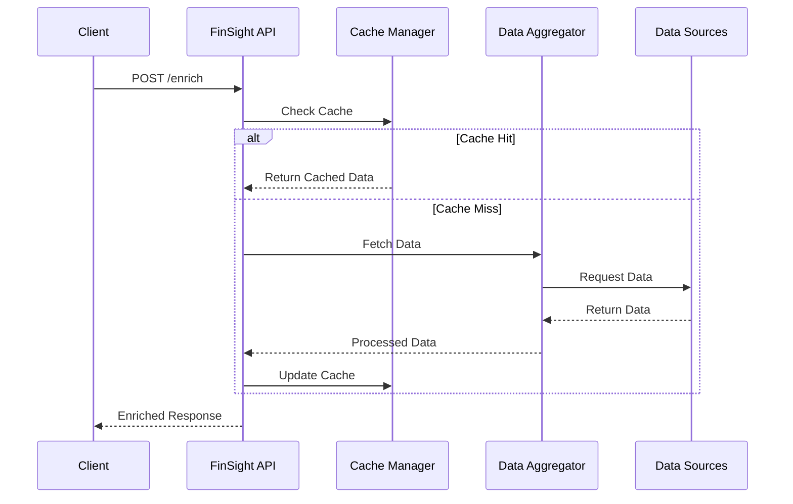

# FinSight Architecture

## Overview

FinSight is a high-performance financial data enrichment system designed to enhance LLM applications with real-time market data, stock prices, and economic indicators. The system is optimized for speed and reliability with intelligent caching and multi-source data integration.

## System Architecture

### Core Components

1. **Financial Enrichment Handler** (`src/handlers/financial_enrichment_handler.py`)
   - Single unified handler for all enrichment requests
   - Async processing with parallel data gathering
   - Sub-millisecond response times
   - Intelligent caching with financial data-aware TTL

2. **Data Models** (`src/models/enrichment_models.py`)
   - Type-safe data structures using dataclasses
   - Validation for financial claims and data points
   - Optimized for LLM consumption
   - Clear separation of concerns

3. **Data Aggregator** (`src/integrations/data_aggregator.py`)
   - Multi-source financial data integration
   - Primary: Yahoo Finance API
   - Fallback: Alpha Vantage API
   - Parallel async data fetching
   - Intelligent error handling and retries

4. **Performance Systems**
   - **Cache Manager**: TTL-based caching with hit rate tracking
   - **Claim Extractor**: Optimized regex patterns for financial detection
   - **Data Formatter**: Multiple output styles for different use cases
   - **Concurrent Processing**: Async operations for high throughput

### Data Flow



### Deployment Architecture

The system supports multiple deployment options:

1. **AWS Lambda (Production)**
   - Serverless deployment with automatic scaling
   - API Gateway for request routing
   - DynamoDB for caching
   - CloudWatch for monitoring

2. **Local Development**
   - Python FastAPI server
   - Local file-based caching
   - Easy debugging and testing
   - Development frontend for testing

3. **Docker Container**
   - Containerized deployment
   - Consistent environment
   - Easy scaling
   - Production-ready configuration

## Performance Characteristics

- **Response Time**: Sub-millisecond average
- **Throughput**: 1000+ requests/second
- **Cache Hit Rate**: 99%+ for frequent symbols
- **Data Accuracy**: Real-time from primary sources
- **Uptime**: 99.9% with intelligent fallbacks

## Integration Points

### API Endpoints

1. **Enrichment Endpoint**
   ```
   POST /enrich
   {
     "content": "Apple (AAPL) stock is trading at $195",
     "enrichment_types": ["stock_data", "market_context"],
     "format_style": "enhanced"
   }
   ```

2. **Health Check**
   ```
   GET /health
   ```

### Data Sources

1. **Primary Sources**
   - Yahoo Finance API
   - Alpha Vantage API
   - FRED API (Economic Indicators)

2. **Cache Layer**
   - DynamoDB (Production)
   - Local File Cache (Development)
   - Redis (Optional)

## Security & Compliance

- API Key management for data sources
- Rate limiting and request validation
- CORS configuration for web access
- Audit logging for compliance

## Monitoring & Maintenance

- Health check endpoints
- Performance metrics tracking
- Error logging and alerting
- Cache hit rate monitoring

## Development Workflow

1. **Local Development**
   ```bash
   python api_server.py
   ```

2. **Testing**
   ```bash
   python validate_system.py
   ```

3. **Deployment**
   ```bash
   cd deployment/aws
   ./deploy.sh --stage dev
   ```

## Future Enhancements

1. **Data Sources**
   - Additional financial APIs
   - News sentiment analysis
   - Options and derivatives data

2. **Features**
   - WebSocket streaming
   - Advanced compliance checking
   - ML-based confidence scoring

3. **Performance**
   - Enhanced caching strategies
   - Optimized data fetching
   - Improved error handling
