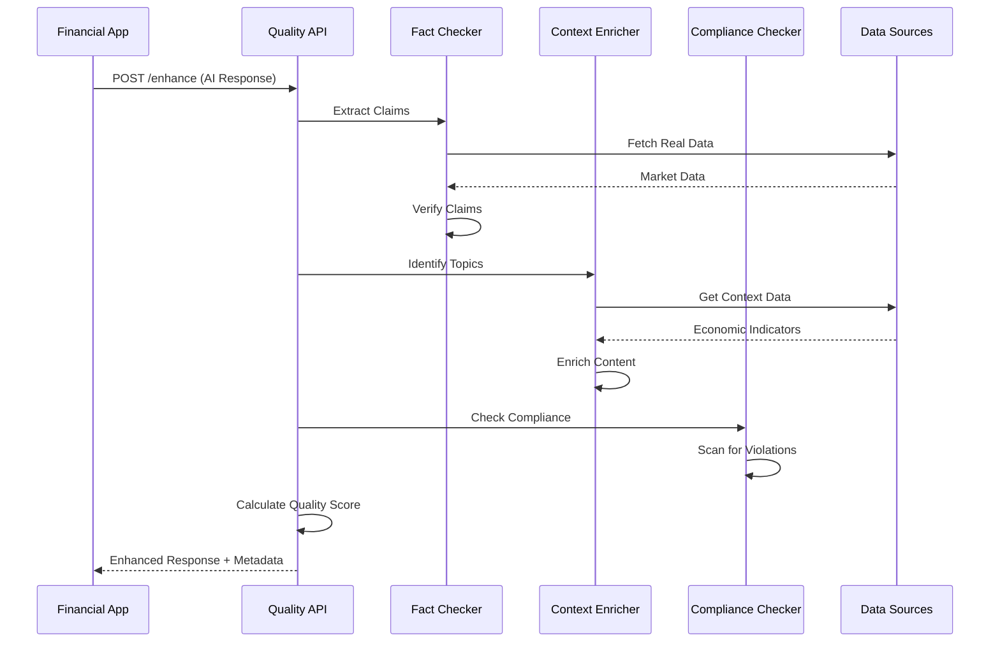
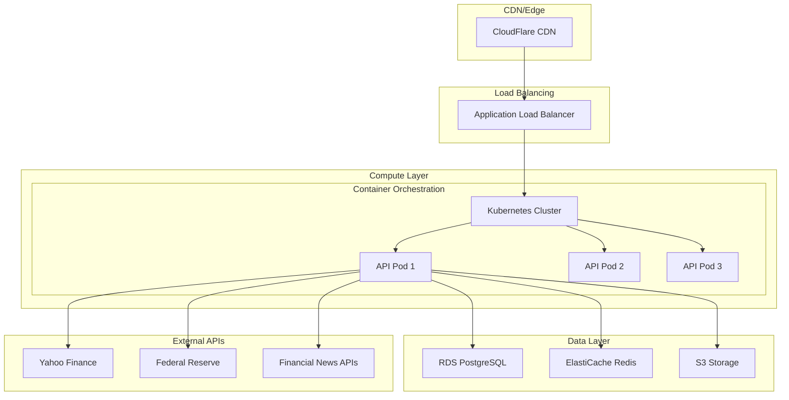
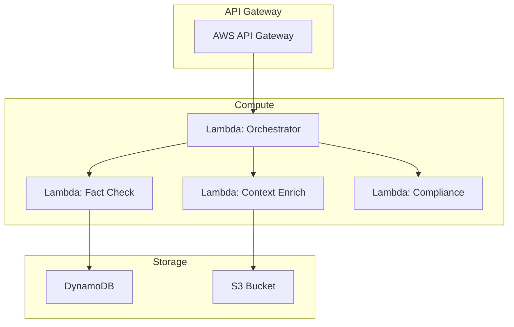

# FinSight AI-Enhanced Financial Fact-Checking System - Architecture

## 🏗️ High-Level System Architecture



```mermaid
graph TB
    subgraph "Client Layer"
        A[Financial Institution] --> B[AI Agent/Chatbot]
        C[Investment Platform] --> D[Portfolio Assistant]
        E[Banking App] --> F[Customer Service Bot]
        G[CLI Users] --> H[Command Line Interface]
        I[Web Users] --> J[Interactive Frontend]
    end
    
    subgraph "API Gateway & Load Balancing"
        K[AWS API Gateway] --> L[Load Balancer]
        L --> M[Rate Limiting]
        L --> N[Authentication]
        L --> O[Request Validation]
    end
    
    subgraph "Core Services Layer"
        P[FinSight API Gateway]
        P --> Q[Enhanced Fact Checker]
        P --> R[Ticker Resolution Service]
        P --> S[Claim Extraction Engine]
        P --> T[Market Data Validator]
    end
    
    subgraph "LLM Integration Layer"
        U[LLM Router/Orchestrator]
        U --> V[Ollama Local LLM]
        U --> W[OpenAI API]
        U --> X[Anthropic API]
        U --> Y[Regex Fallback Engine]
        
        V --> V1[llama3.2:3b Model]
        V --> V2[Alternative Models]
    end
    
    subgraph "Enhanced Processing Services"
        Z[Enhanced Ticker Resolver]
        AA[Confidence Scoring Engine]
        BB[Cache Management System]
        CC[Concurrent Processing Pool]
        DD[Multi-Strategy Validator]
    end
    
    subgraph "Data Sources & APIs"
        EE[Yahoo Finance API]
        FF[Federal Reserve Data]
        GG[SEC Filings]
        HH[Real-time Market Data]
        II[Economic Indicators]
        JJ[Company Mappings Database]
    end
    
    subgraph "Storage & Caching"
        KK[Redis Cache - TTL Based]
        LL[Local File Cache]
        MM[AWS S3 - Results Storage]
        NN[DynamoDB - Audit Logs]
        OO[Ticker Resolution Cache]
    end
    
    subgraph "Deployment Options"
        PP[AWS Lambda Serverless]
        QQ[Docker Containers]
        RR[Local Development]
        SS[Cloud Run/App Runner]
    end
    
    subgraph "Monitoring & Analytics"
        TT[CloudWatch Metrics]
        UU[Performance Analytics]
        VV[Error Tracking]
        WW[Usage Statistics]
        XX[Confidence Score Tracking]
    end

    B --> P
    D --> P
    F --> P
    H --> P
    J --> P
    
    Q --> U
    S --> U
    
    Q --> Z
    R --> Z
    T --> EE
    T --> FF
    T --> GG
    T --> HH
    T --> II
    
    Z --> JJ
    Z --> EE
    
    Q --> KK
    R --> KK
    S --> LL
    Z --> OO
    
    P --> MM
    P --> NN
    
    P --> TT
    Q --> UU
    S --> VV
    Z --> WW
    AA --> XX
```

## 🧠 LLM Integration Strategy

### Primary: Ollama (Local Hosting)
- **Model**: llama3.2:3b (recommended for speed/accuracy balance)
- **Deployment**: Local development, Docker containers
- **Advantages**: No API costs, privacy, offline capability
- **Use Cases**: Development, on-premise deployments, cost-sensitive scenarios

### Cloud Fallbacks: OpenAI/Anthropic
- **Models**: GPT-4o-mini, Claude-3-Haiku
- **Deployment**: AWS Lambda, serverless environments  
- **Advantages**: Scalability, reliability, no infrastructure management
- **Use Cases**: Production serverless, high-scale deployments

### Regex Engine (Always Available)
- **Implementation**: Pattern-based extraction
- **Deployment**: All environments
- **Advantages**: Fast, reliable, no dependencies
- **Use Cases**: Fallback, basic functionality, resource-constrained environments
        EE[Grafana Dashboard]
        FF[Error Tracking]
        GG[Performance Monitor]
    end
    
    B --> G
    D --> G
    F --> G
    
    L --> Q
    L --> R
    L --> S
    L --> T
    
    M --> U
    M --> V
    N --> W
    N --> X
    O --> Y
    
    L --> Z
    L --> AA
    L --> BB
    L --> CC
    
    L --> DD
    DD --> EE
    L --> FF
    L --> GG
    
    classDef client fill:#e1f5fe
    classDef api fill:#f3e5f5
    classDef ai fill:#fff3e0
    classDef data fill:#e8f5e8
    classDef storage fill:#fff8e1
    classDef monitoring fill:#fce4ec
    
    class A,B,C,D,E,F client
    class G,H,I,J,K,L,M,N,O,P api
    class Q,R,S,T ai
    class U,V,W,X,Y data
    class Z,AA,BB,CC storage
    class DD,EE,FF,GG monitoring
```

## 🔄 Data Flow Architecture



## 🏢 Deployment Architecture Options

### Option 1: Cloud-Native (Recommended)


### Option 2: Serverless


## 📊 Component Details

### Core Components
- **Fact Checking Engine**: Validates financial claims against real-time data
- **Context Enrichment Service**: Adds relevant market context and economic indicators
- **Compliance Checker**: Scans for regulatory violations and investment advice
- **Quality Scorer**: Calculates confidence metrics for AI responses

### Data Sources
- **Yahoo Finance**: Real-time stock prices and company data
- **Federal Reserve**: Economic indicators and monetary policy data
- **SEC Database**: Regulatory filings and compliance information
- **News APIs**: Market sentiment and breaking news

### Technology Stack
- **Backend**: FastAPI (Python)
- **Database**: PostgreSQL for audit trails, Redis for caching
- **Containerization**: Docker + Kubernetes
- **Monitoring**: Prometheus + Grafana
- **Authentication**: JWT tokens + API keys
