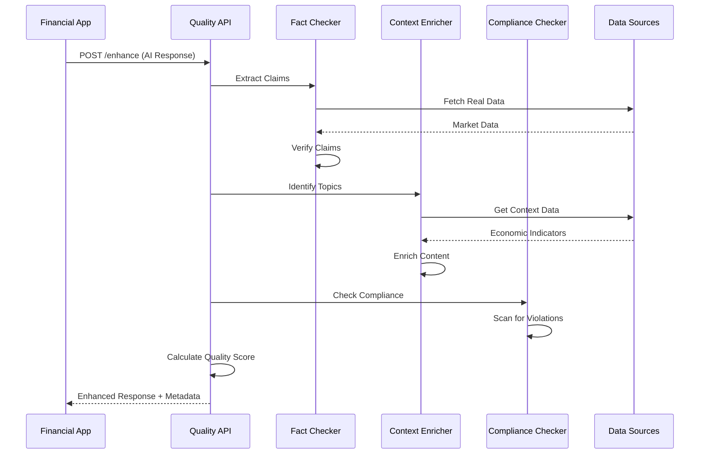
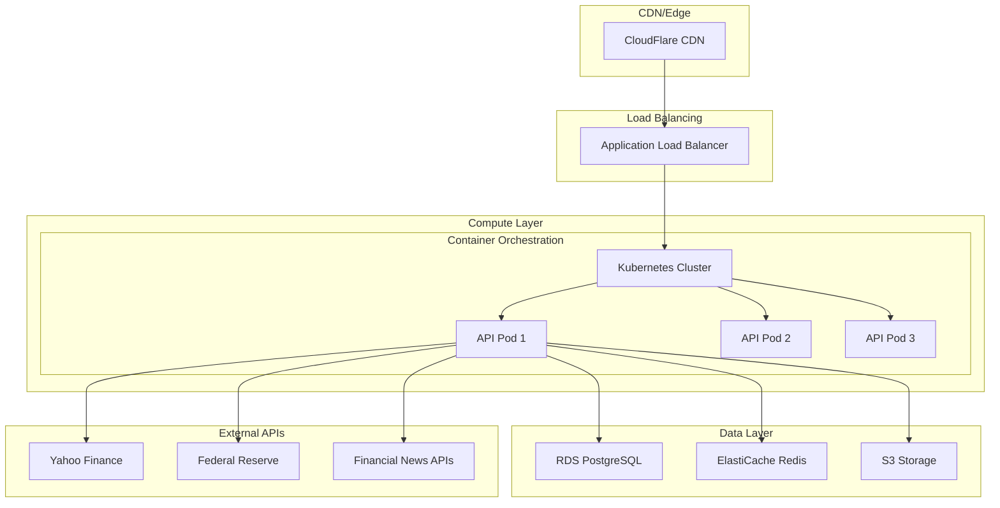
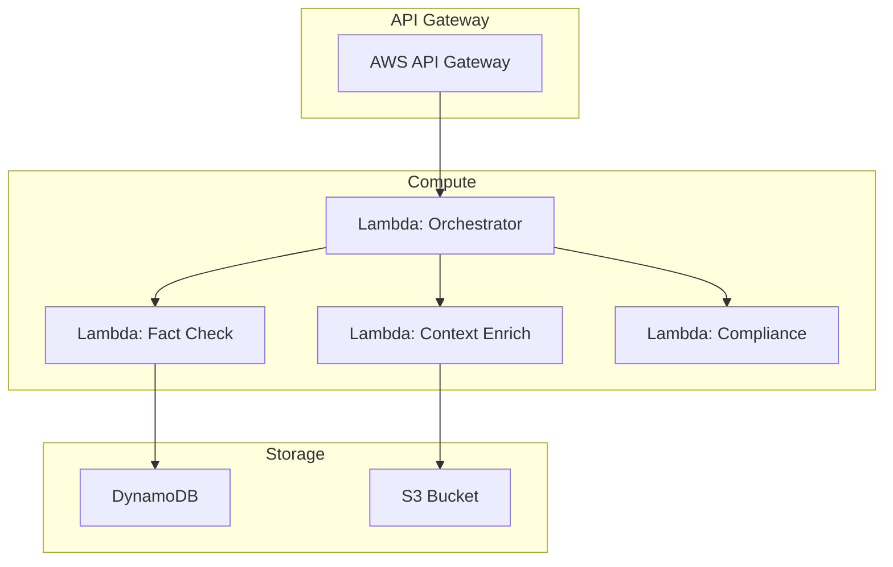

# Financial AI Quality Enhancement API - Architecture

## 🏗️ High-Level System Architecture

```mermaid
graph TB
    subgraph "Client Layer"
        A[Financial Institution] --> B[AI Agent/Chatbot]
        C[Investment Platform] --> D[Portfolio Assistant]
        E[Banking App] --> F[Customer Service Bot]
    end
    
    subgraph "API Gateway"
        G[Load Balancer] --> H[API Gateway]
        H --> I[Rate Limiting]
        H --> J[Authentication]
        H --> K[Request Validation]
    end
    
    subgraph "Core API Services"
        L[Financial AI Quality API]
        L --> M[Fact Checking Engine]
        L --> N[Context Enrichment Service]
        L --> O[Compliance Checker]
        L --> P[Quality Scorer]
    end
    
    subgraph "AI/ML Layer"
        Q[LLM Integration]
        R[NLP Processing]
        S[Pattern Recognition]
        T[Sentiment Analysis]
    end
    
    subgraph "Data Sources"
        U[Yahoo Finance API]
        V[Federal Reserve Data]
        W[SEC Filings]
        X[Real-time Market Data]
        Y[Regulatory Databases]
    end
    
    subgraph "Storage & Caching"
        Z[Redis Cache]
        AA[PostgreSQL DB]
        BB[Audit Logs]
        CC[Analytics Data]
    end
    
    subgraph "Monitoring & Analytics"
        DD[Prometheus Metrics]
        EE[Grafana Dashboard]
        FF[Error Tracking]
        GG[Performance Monitor]
    end
    
    B --> G
    D --> G
    F --> G
    
    L --> Q
    L --> R
    L --> S
    L --> T
    
    M --> U
    M --> V
    N --> W
    N --> X
    O --> Y
    
    L --> Z
    L --> AA
    L --> BB
    L --> CC
    
    L --> DD
    DD --> EE
    L --> FF
    L --> GG
    
    classDef client fill:#e1f5fe
    classDef api fill:#f3e5f5
    classDef ai fill:#fff3e0
    classDef data fill:#e8f5e8
    classDef storage fill:#fff8e1
    classDef monitoring fill:#fce4ec
    
    class A,B,C,D,E,F client
    class G,H,I,J,K,L,M,N,O,P api
    class Q,R,S,T ai
    class U,V,W,X,Y data
    class Z,AA,BB,CC storage
    class DD,EE,FF,GG monitoring
```

## 🔄 Data Flow Architecture

## 🏢 Deployment Architecture Options

### Option 1: Cloud-Native (Recommended)

### Option 2: Serverless

## 📊 Component Details

### Core Components
- **Fact Checking Engine**: Validates financial claims against real-time data
- **Context Enrichment Service**: Adds relevant market context and economic indicators
- **Compliance Checker**: Scans for regulatory violations and investment advice
- **Quality Scorer**: Calculates confidence metrics for AI responses

### Data Sources
- **Yahoo Finance**: Real-time stock prices and company data
- **Federal Reserve**: Economic indicators and monetary policy data
- **SEC Database**: Regulatory filings and compliance information
- **News APIs**: Market sentiment and breaking news

### Technology Stack
- **Backend**: FastAPI (Python)
- **Database**: PostgreSQL for audit trails, Redis for caching
- **Containerization**: Docker + Kubernetes
- **Monitoring**: Prometheus + Grafana
- **Authentication**: JWT tokens + API keys
