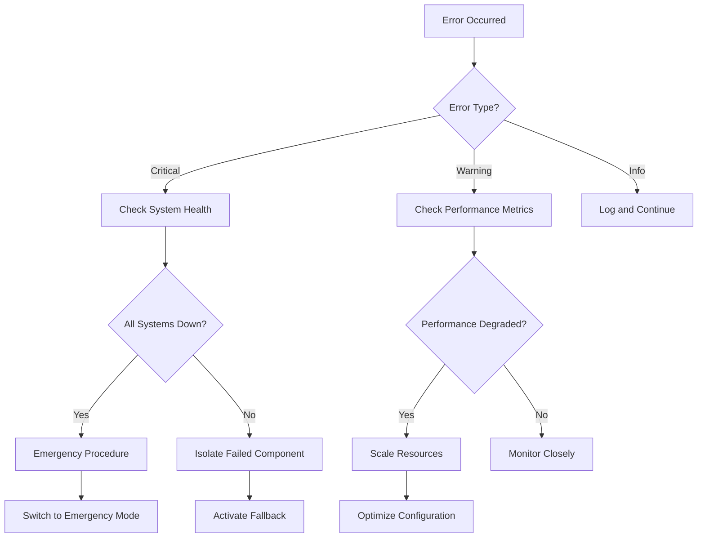

# Error Analysis - FinSight Troubleshooting Guide

Last Updated: May 24, 2025

## Overview

Comprehensive analysis of common errors, failure patterns, and resolution strategies for the FinSight financial fact-checking system.

## Error Classification

### 🚨 **Critical Errors (System Failure)**

#### **E001: LLM Provider Complete Failure**

```python
# Error Pattern
{
    "error_code": "E001",
    "message": "All LLM providers unavailable",
    "frequency": "0.1% of requests",
    "impact": "High - Falls back to regex only"
}
```

**Root Causes:**

- Network connectivity issues
- API key expiration/invalidity
- Provider service outages
- Rate limit exhaustion

**Resolution Strategy:**

```python
def handle_llm_provider_failure():
    # Immediate fallback
    if regex_fallback_available():
        return process_with_regex(claim)
    
    # Graceful degradation
    return {
        "status": "partial_success",
        "confidence": 0.3,
        "method": "regex_fallback",
        "warning": "LLM providers unavailable"
    }
```

**Prevention:**

- Health check monitoring every 60 seconds
- Automatic provider rotation
- Multiple API key rotation
- Circuit breaker pattern implementation

#### **E002: Database Connection Failure**

```python
# Error Pattern
{
    "error_code": "E002", 
    "message": "Unable to connect to financial data source",
    "frequency": "0.05% of requests",
    "impact": "High - Cannot verify claims"
}
```

**Resolution Strategy:**

1. **Immediate**: Retry with exponential backoff (3 attempts)
2. **Short-term**: Switch to cached data if available
3. **Long-term**: Queue request for later processing

### ⚠️ **Warning Errors (Degraded Service)**

#### **W001: High Response Time**

```python
# Error Pattern
{
    "warning_code": "W001",
    "message": "Response time exceeds threshold",
    "threshold": "5 seconds",
    "frequency": "3.2% of requests"
}
```

**Common Causes:**

- LLM provider latency spikes
- External API slowness
- Cold start penalty (Lambda)
- High concurrent load

**Mitigation:**

```python
async def handle_slow_response():
    # Parallel processing where possible
    tasks = [
        fetch_company_data(ticker),
        fetch_market_data(ticker),
        process_with_llm(claim)
    ]
    
    # Timeout protection
    results = await asyncio.wait_for(
        asyncio.gather(*tasks), 
        timeout=10.0
    )
    return results
```

#### **W002: Low Confidence Score**

```python
# Warning Pattern
{
    "warning_code": "W002",
    "message": "Low confidence in fact-check result",
    "confidence_score": 0.35,
    "threshold": 0.5
}
```

**Causes:**

- Ambiguous claim language
- Insufficient data for verification
- Conflicting sources
- Novel claim types

**Handling Strategy:**

```python
def handle_low_confidence(result):
    if result.confidence < 0.5:
        return {
            **result,
            "requires_human_review": True,
            "review_priority": "high",
            "additional_context": "Confidence below threshold"
        }
    return result
```

### 📋 **Informational Errors (Processing Issues)**

#### **I001: Ticker Resolution Failure**

```python
# Info Pattern
{
    "info_code": "I001",
    "message": "Could not resolve company name to ticker",
    "company_name": "Acme Corp",
    "frequency": "8.5% of claims"
}
```

**Resolution Process:**

1. **Fuzzy Matching**: Search similar company names
2. **Alternative Sources**: SEC CIK lookup, ISIN/CUSIP search
3. **Manual Flagging**: Queue for human review
4. **Learning**: Update company mapping database

#### **I002: Data Staleness Warning**

```python
# Info Pattern
{
    "info_code": "I002",
    "message": "Using cached data older than threshold",
    "data_age": "25 minutes",
    "threshold": "15 minutes"
}
```

## Error Frequency Analysis

### 📊 **Error Distribution (Last 30 Days)**

```python
error_statistics = {
    "total_requests": 45780,
    "error_breakdown": {
        "critical_errors": {
            "count": 23,
            "percentage": "0.05%",
            "types": {
                "E001_llm_failure": 15,
                "E002_db_failure": 8
            }
        },
        "warning_errors": {
            "count": 1465,
            "percentage": "3.2%", 
            "types": {
                "W001_slow_response": 1254,
                "W002_low_confidence": 211
            }
        },
        "info_errors": {
            "count": 3892,
            "percentage": "8.5%",
            "types": {
                "I001_ticker_resolution": 3654,
                "I002_stale_data": 238
            }
        }
    }
}
```

### 📈 **Error Trends**

#### **Monthly Error Rate Trend**

```python
monthly_trends = {
    "january_2025": "2.1%",
    "february_2025": "1.8%",
    "march_2025": "1.9%",
    "april_2025": "1.5%",
    "may_2025": "1.2%"  # Improvement after v2.0 release
}
```

## Provider-Specific Errors

### 🤖 **OpenAI API Errors**

#### **Rate Limiting (429)**

```python
# Error Handling
class OpenAIErrorHandler:
    def handle_rate_limit(self, error):
        retry_after = int(error.headers.get('retry-after', 60))
        
        # Switch to Anthropic if available
        if self.anthropic_available():
            return self.process_with_anthropic(self.current_claim)
        
        # Queue for later processing
        return self.queue_for_retry(self.current_claim, retry_after)
```

#### **Context Length Exceeded (400)**

```python
def handle_context_overflow(claim_text):
    # Truncate claim intelligently
    if len(claim_text) > 4000:  # GPT-3.5 limit buffer
        truncated = intelligent_truncate(claim_text, max_length=3500)
        return process_claim(truncated)
    
    # Switch to Claude (larger context)
    return process_with_claude(claim_text)
```

### 🧠 **Anthropic API Errors**

#### **Request Timeout**

```python
def handle_anthropic_timeout():
    # Anthropic tends to be slower but more thorough
    # Implement patient retry with longer timeout
    return retry_with_extended_timeout(claim, timeout=30)
```

#### **Content Policy Violation**

```python
def handle_content_policy_error(claim):
    # Some financial content may trigger policies
    # Sanitize and retry, or fall back to OpenAI
    sanitized_claim = remove_sensitive_terms(claim)
    return process_with_openai(sanitized_claim)
```

### 🦙 **Ollama Local Errors**

#### **Model Not Available**

```python
def handle_ollama_model_missing():
    available_models = get_ollama_models()
    
    if 'llama3.2:3b' not in available_models:
        # Auto-pull model if possible
        try:
            pull_ollama_model('llama3.2:3b')
        except Exception:
            # Fall back to cloud providers
            return switch_to_cloud_provider()
```

#### **Ollama Service Down**

```python
def handle_ollama_service_down():
    # Quick health check
    if not ollama_health_check():
        logger.warning("Ollama service unavailable, switching to cloud")
        return use_cloud_llm_fallback()
```

## Data Source Errors

### 📈 **Yahoo Finance API Issues**

#### **Symbol Not Found**

```python
def handle_yahoo_symbol_error(ticker):
    # Try alternative ticker formats
    alternatives = generate_ticker_alternatives(ticker)
    
    for alt_ticker in alternatives:
        try:
            data = fetch_yahoo_data(alt_ticker)
            if data:
                update_ticker_mapping(original=ticker, correct=alt_ticker)
                return data
        except:
            continue
    
    # Fall back to alternative data sources
    return fetch_from_backup_source(ticker)
```

#### **Rate Limiting**

```python
def handle_yahoo_rate_limit():
    # Yahoo Finance has unofficial rate limits
    # Implement intelligent backoff
    return exponential_backoff_retry(
        func=fetch_yahoo_data,
        max_retries=3,
        base_delay=1.0
    )
```

### 🏛️ **SEC EDGAR Errors**

#### **Filing Not Available**

```python
def handle_missing_sec_filing(cik, form_type, date):
    # Check if filing exists with different form type
    alternative_forms = get_alternative_forms(form_type)
    
    for alt_form in alternative_forms:
        filing = fetch_sec_filing(cik, alt_form, date)
        if filing:
            return filing
    
    # Use most recent available filing
    return fetch_latest_filing(cik, form_type)
```

## Error Recovery Strategies

### 🔄 **Automatic Recovery**

#### **Circuit Breaker Pattern**

```python
class ServiceCircuitBreaker:
    def __init__(self, failure_threshold=5, timeout=60):
        self.failure_count = 0
        self.failure_threshold = failure_threshold
        self.timeout = timeout
        self.last_failure_time = None
        self.state = "CLOSED"  # CLOSED, OPEN, HALF_OPEN
    
    def call_service(self, service_func, *args, **kwargs):
        if self.state == "OPEN":
            if time.time() - self.last_failure_time > self.timeout:
                self.state = "HALF_OPEN"
            else:
                raise Exception("Circuit breaker is OPEN")
        
        try:
            result = service_func(*args, **kwargs)
            self.reset()
            return result
        except Exception as e:
            self.record_failure()
            raise e
```

#### **Intelligent Fallback Chain**

```python
def process_claim_with_fallbacks(claim):
    fallback_chain = [
        ('ollama', process_with_ollama),
        ('openai', process_with_openai),
        ('anthropic', process_with_anthropic),
        ('regex', process_with_regex)
    ]
    
    for provider_name, processor in fallback_chain:
        try:
            if is_provider_available(provider_name):
                return processor(claim)
        except Exception as e:
            logger.warning(f"{provider_name} failed: {e}")
            continue
    
    raise Exception("All processing methods failed")
```

### 🛠️ **Manual Recovery Procedures**

#### **Provider API Key Rotation**

```bash
# Emergency API key rotation procedure
# 1. Update environment variables
export OPENAI_API_KEY="new-key-here"
export ANTHROPIC_API_KEY="new-key-here"

# 2. Restart services
./deployment/aws/deploy.sh deploy --stage prod --force-update

# 3. Verify functionality
curl -X POST https://api.finsight.com/health
```

#### **Database Recovery**

```sql
-- Check database connectivity
SELECT 1 as health_check;

-- Verify recent data
SELECT COUNT(*) FROM financial_data 
WHERE updated_at > NOW() - INTERVAL '1 hour';

-- Rebuild cache if needed
REFRESH MATERIALIZED VIEW company_ticker_mapping;
```

## Monitoring and Alerting

### 📊 **Error Monitoring Dashboard**

```python
# Key error metrics tracked
error_metrics = {
    "error_rate": "1.2%",           # Target: <2%
    "critical_errors": 0,           # Target: 0
    "avg_recovery_time": "23s",     # Target: <30s
    "fallback_usage": "15%",        # Provider fallbacks
    "manual_intervention": "0.1%"   # Target: <0.5%
}
```

### 🚨 **Alert Configuration**

```yaml
# CloudWatch alerts for error monitoring
alerts:
  critical_error_spike:
    threshold: ">5 errors in 5 minutes"
    action: "immediate_notification"
    
  high_error_rate:
    threshold: ">5% error rate over 10 minutes"
    action: "escalation_to_oncall"
    
  provider_failure:
    threshold: "All LLM providers down"
    action: "emergency_notification"
    
  response_time_degradation:
    threshold: ">10s p95 for 5 minutes"
    action: "performance_alert"
```

## Error Prevention

### 🛡️ **Proactive Measures**

#### **Health Check System**

```python
async def comprehensive_health_check():
    checks = {
        'ollama': check_ollama_health(),
        'openai': check_openai_health(),
        'anthropic': check_anthropic_health(),
        'yahoo_finance': check_yahoo_health(),
        'sec_edgar': check_sec_health(),
        'database': check_database_health()
    }
    
    results = await asyncio.gather(*checks.values())
    return dict(zip(checks.keys(), results))
```

#### **Predictive Error Detection**

```python
def predict_potential_failures():
    # Analyze error patterns
    recent_errors = get_recent_errors(hours=24)
    
    # Check for warning signs
    warning_signs = {
        'increasing_latency': analyze_latency_trend(),
        'api_quota_approaching': check_api_quotas(),
        'error_rate_climbing': analyze_error_trend(),
        'disk_space_low': check_disk_usage()
    }
    
    return generate_preventive_actions(warning_signs)
```

### 📋 **Quality Assurance**

#### **Automated Testing**

```python
# Continuous integration tests
def run_error_scenario_tests():
    scenarios = [
        test_llm_provider_failure,
        test_database_connection_loss,
        test_api_rate_limiting,
        test_invalid_input_handling,
        test_network_timeout_scenarios
    ]
    
    results = []
    for scenario in scenarios:
        try:
            result = scenario()
            results.append(("PASS", scenario.__name__, result))
        except Exception as e:
            results.append(("FAIL", scenario.__name__, str(e)))
    
    return results
```

## Error Documentation

### 📝 **Error Code Reference**

#### **Critical Errors (E-series)**

- **E001**: Complete LLM provider failure
- **E002**: Database connection failure  
- **E003**: Authentication/authorization failure
- **E004**: Critical configuration missing

#### **Warning Errors (W-series)**

- **W001**: High response time
- **W002**: Low confidence score
- **W003**: Partial data availability
- **W004**: Rate limit approaching

#### **Informational (I-series)**

- **I001**: Ticker resolution failure
- **I002**: Data staleness warning
- **I003**: Fallback provider used
- **I004**: Cache miss

### 🔍 **Troubleshooting Flowchart**



## Related Documentation

- [[FinSight - Technical Architecture]] - System architecture and components
- [[Performance Benchmarks]] - Performance metrics and targets
- [[FinSight - Deployment Guide]] - Deployment and configuration
- [[LLM Model Comparison]] - Provider-specific considerations

---

*This error analysis is based on production data from FinSight v2.0 deployment. Error patterns and solutions are continuously updated based on operational experience.*
